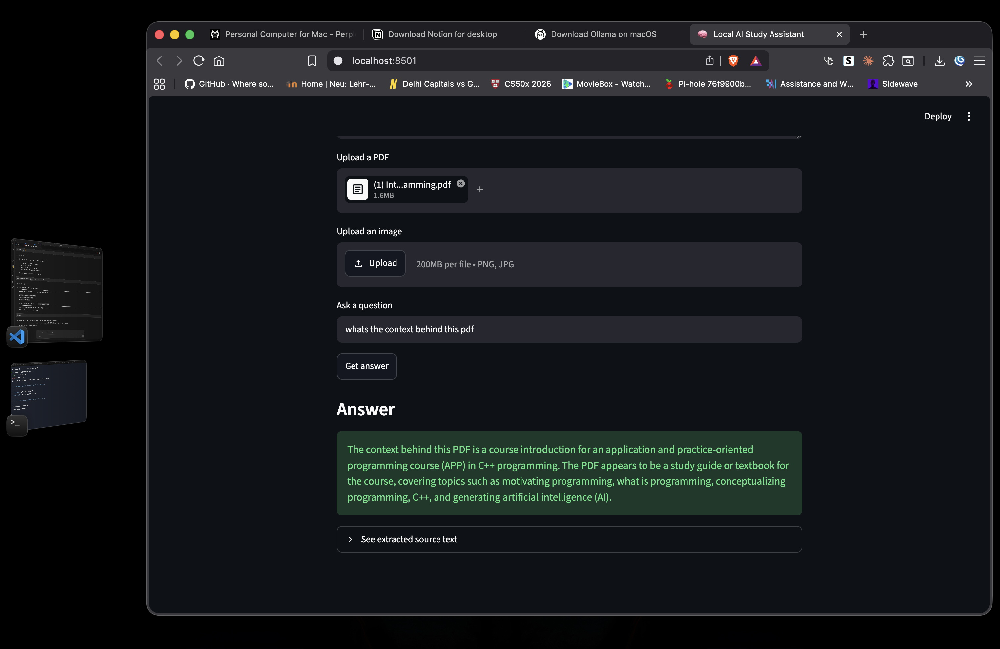

# Local AI Study Assistant

A locally-running AI tool that answers questions about your study materials — PDFs, images, or pasted notes — using a local LLM. No internet connection required, no API keys, no data leaves your machine.



---

## What it does

1. You paste notes, upload a PDF, or upload an image
2. The app extracts the text from your material
3. You ask a question
4. A local LLM (via Ollama) answers based on your material only

---

## Features

- PDF text extraction (PyMuPDF)
- Image OCR using Apple's native Vision framework (macOS only)
- Fully local LLM via Ollama — no API keys needed
- Clean Streamlit UI

---

## Tech stack

| Tool | Purpose |
|------|---------|
| Python | Core language |
| Streamlit | Web UI |
| PyMuPDF | PDF text extraction |
| ocrmac | Image OCR (macOS Vision framework) |
| Ollama | Local LLM runtime |
| llama3.2:3b | LLM model |

---

## Requirements

- macOS (ocrmac uses Apple's Vision framework)
- [Ollama](https://ollama.com) installed and running
- Python 3.10+

---

## Installation

```bash
# 1. Clone the repo
git clone https://github.com/nayalambaliya/study-assistant.git
cd study-assistant

# 2. Create a virtual environment
python3 -m venv .venv
source .venv/bin/activate

# 3. Install dependencies
pip install -r requirements.txt

# 4. Pull the LLM model
ollama pull llama3.2:3b
```

---

## How to run

```bash
# Make sure Ollama is running in the background
ollama serve

# In a separate terminal, start the app
streamlit run app.py
```

Then open [http://localhost:8501](http://localhost:8501) in your browser.

---

## Screenshots


---

## Future improvements

- [ ] Model switcher (choose between different Ollama models)
- [ ] Persistent chat history saved to disk
- [ ] Support for `.docx` and `.pptx` files
